# Database Schema Documentation

## Overview

This document describes the database structure for The Cloud Sucks platform, a comprehensive directory and assessment system for privacy-focused technology alternatives including services, mobile apps, operating systems, hardware, and self-hosted software.

## Core Assessment Framework

All content collections share a common assessment framework based on the **GoodPhone Foundation's Digital Sovereignty Tiers**:

- **Tier A (Sovereign)**: Maximum user control, open source, strong privacy
- **Tier B (Aligned)**: Good privacy, some trade-offs
- **Tier C (Transitional)**: Mixed approach, convenience over privacy
- **Tier D (Extractive)**: Extractive business models, poor privacy

### Common Fields Across Collections

Most primary collections include:
- **Scores**: JSON object with dimensions (0-4 scale)
  - `autonomy`: User independence and control
  - `transparency`: Openness and accountability
  - `control_ownership`: Data ownership and portability
  - `resilience`: Long-term sustainability
  - `human_impact`: Societal benefit
- **Tier**: Sovereignty tier classification
- **Recommended Use**: `recommended | situational | avoid | compare_only`
- **Audience Level**: `beginner | intermediate | advanced | all`
- **Brand Assets**: Auto-fetched via Brandfetch flows
  - `brand_logo_light/dark`: Full logos
  - `brand_symbol_light/dark`: Icon/symbol variants

## Entity Relationship Diagram

```mermaid
erDiagram
    %% Core Content Collections
    services ||--o{ services_service_categories : "belongs to"
    services }o--|| service_vendors : "maintained by"
    service_categories ||--o{ services_service_categories : "categorizes"
    
    mobile_apps ||--o{ mobile_apps_mobile_app_categories : "belongs to"
    mobile_app_categories ||--o{ mobile_apps_mobile_app_categories : "categorizes"
    
    operating_systems {
        uuid id PK
        string name
        string slug
        string tagline
        text description
        uuid logo_light FK
        uuid logo_dark FK
        string os_scope "mobile|desktop|server|embedded"
        string kernel_type "linux|bsd|nt|xnu|other"
        string tier "A_Sovereign|B_Aligned|C_Transitional|D_Extractive"
        boolean is_open_source
        string governance_model
        json scores
    }
    
    hardware_items {
        uuid id PK
        string name
        string slug
        string hardware_type "phone|laptop|router|tablet|nas"
        string manufacturer
        uuid brand_logo_light FK
        uuid brand_logo_dark FK
        uuid brand_symbol_light FK
        uuid brand_symbol_dark FK
        string repairability "high|medium|low"
        string bootloader_unlockable
        string tier
        json scores
    }
    
    selfhosted_alternatives {
        uuid id PK
        string name
        string slug
        text short_description
        json replaces "mainstream services"
        string category "cloud_storage|messaging|email|etc"
        json hosting_modes
        string deployment_complexity
        boolean is_open_source
        string tier
        uuid brand_logo_light FK
        uuid brand_logo_dark FK
        uuid brand_symbol_light FK
        uuid brand_symbol_dark FK
    }
    
    services {
        uuid id PK
        string name
        string slug
        text short_description
        text long_description
        string website_url
        string service_status
        string primary_business_model
        string governance_model
        boolean self_hostable
        boolean federated
        string end_to_end_encryption
        string default_tracking
        string assessment_tier
        json scores
        uuid brand_logo_light FK
        uuid brand_logo_dark FK
        uuid brand_symbol_light FK
        uuid brand_symbol_dark FK
        uuid vendor FK
    }
    
    mobile_apps {
        uuid id PK
        string name
        string slug
        string developer_name
        text short_description
        string primary_category
        json platforms_supported
        boolean is_open_source
        boolean requires_phone_number
        string end_to_end_encryption
        string tier
        uuid app_icon_light FK
        uuid app_icon_dark FK
        uuid brand_logo_light FK
        uuid brand_logo_dark FK
    }
    
    service_vendors {
        uuid id PK
        string name
        string slug
        string jurisdiction
        string ownership_type
    }
    
    service_categories {
        uuid id PK
        string name
        string slug
        text description
        string risk_profile
        integer order
    }
    
    mobile_app_categories {
        uuid id PK
        string name
        string slug
        text description
    }
    
    %% Page Builder System
    pages ||--o{ page_blocks : "contains"
    page_blocks }o--|| block_services_showcase : "displays"
    page_blocks }o--|| block_mobile_apps_showcase : "displays"
    page_blocks }o--|| block_os_showcase : "displays"
    page_blocks }o--|| block_hardware_showcase : "displays"
    page_blocks }o--|| block_selfhosted_showcase : "displays"
    page_blocks }o--|| block_hero : "displays"
    page_blocks }o--|| block_richtext : "displays"
    
    pages {
        uuid id PK
        string title
        string permalink
        string status
        uuid seo FK
    }
    
    page_blocks {
        uuid id PK
        uuid pages_id FK
        string collection "polymorphic"
        string item "polymorphic"
        integer sort
    }
    
    %% Content & Blog
    posts ||--o| categories : "categorized"
    posts }o--|| team : "authored by"
    posts }o--|| seo : "has"
    posts ||--o{ post_gallery_items : "has gallery"
    
    posts {
        uuid id PK
        string title
        string slug
        text summary
        text content
        string type "blog|project|video"
        datetime date_published
        string status
        uuid category FK
        uuid author FK
        integer discourse_topic_id
    }
    
    %% Discourse Integration
    discourse_posts {
        uuid id PK
        integer topic_id
        string title
        text excerpt
        string author_username
        datetime created_at
        integer reply_count
    }
    
    discourse_comments {
        uuid id PK
        integer post_id
        integer topic_id
        text content
        string author_username
        datetime created_at
    }
    
    %% Assets
    directus_files {
        uuid id PK
        string filename_disk
        string filename_download
        string title
        string type "MIME type"
        string storage
        integer filesize
        integer width
        integer height
    }
    
    operating_systems }o--|| directus_files : "logo_light"
    operating_systems }o--|| directus_files : "logo_dark"
    hardware_items }o--|| directus_files : "brand assets"
    selfhosted_alternatives }o--|| directus_files : "brand assets"
    services }o--|| directus_files : "brand assets"
    mobile_apps }o--|| directus_files : "app icons & logos"
    posts }o--|| directus_files : "featured image"
```

## Primary Collections

### 1. Services

**Purpose**: Directory of online services (VPNs, email providers, messaging services, cloud storage, etc.)

**Key Features**:
- Comprehensive privacy and security assessments
- Vendor relationships and ownership tracking
- Multi-category support via M2M relationships
- Open source status for clients and servers
- Technical specifications (protocols, features, platforms)

**Assessment Fields**:
- Individual scores: privacy, autonomy, transparency, governance (0-4)
- Overall assessment tier (A-D)
- Detailed assessments for data control, governance, and business model

**Relationships**:
- Many-to-Many with `service_categories` via `services_service_categories`
- Many-to-One with `service_vendors`

### 2. Mobile Apps

**Purpose**: Consumer-facing mobile applications for Android and iOS

**Key Features**:
- Platform-specific URLs (Google Play, App Store, F-Droid)
- Privacy characteristics (phone number requirement, E2E encryption)
- Alternative distribution methods tracking
- App icon management (`app_icon_light/dark`)
- "Replaces" field to show mainstream alternatives

**Assessment Fields**:
- Governance and business model analysis
- Privacy scores across multiple dimensions
- Tradeoffs documentation

**Relationships**:
- Many-to-Many with `mobile_app_categories` via `mobile_apps_mobile_app_categories`

### 3. Operating Systems

**Purpose**: Operating systems directory with sovereignty assessments

**Key Features**:
- Detailed technical specifications (kernel type, package manager)
- Security features (verified boot, disk encryption, MAC)
- Privacy controls (telemetry, forced updates)
- Governance and funding transparency
- FOSS percentage tracking

**Scope Categories**:
- Mobile (Android variants, iOS)
- Desktop (Linux, Windows, macOS)
- Server (server distributions)
- Embedded (IoT, specialized systems)

**Assessment Fields**:
- 10-point scoring system for key dimensions
- Tier rationale documentation
- Usage notes and alternative recommendations

### 4. Hardware Items

**Purpose**: Hardware catalog with privacy and repairability focus

**Key Features**:
- Repairability and parts availability tracking
- Warranty and software support duration
- Bootloader unlocking and custom firmware support
- Telemetry and cloud dependency assessment
- Key specifications storage (JSON)

**Hardware Types**:
- phone, laptop, tablet, router, desktop, nas, other

**Assessment Fields**:
- Supply chain considerations
- Compatibility notes
- Privacy and autonomy scores

### 5. Self-Hosted Alternatives

**Purpose**: Self-hosted software alternatives to mainstream cloud services

**Key Features**:
- Deployment complexity assessment
- Required technical skills documentation
- Resource requirements
- Open standards/protocols support (WebDAV, CalDAV, etc.)
- Migration guidance from mainstream services

**Categories**:
- cloud_storage, file_sync, photos, docs, email, calendar, notes, passwords, messaging, backup, other

**Assessment Fields**:
- Hosting modes (self_hosted, managed_hosting)
- Encryption at rest and end-to-end
- Bus factor risk
- Data portability notes

## Page Builder System

### Block Types for Showcases

1. **block_services_showcase**: Display services directory
2. **block_mobile_apps_showcase**: Display mobile apps catalog
3. **block_os_showcase**: Display operating systems directory
4. **block_hardware_showcase**: Display hardware items
5. **block_selfhosted_showcase**: Display self-hosted alternatives

### Page Blocks (Many-to-Any Pattern)

The `page_blocks` collection uses Directus's M2A (Many-to-Any) pattern:
- `pages_id`: Foreign key to pages
- `collection`: Name of the block type collection
- `item`: UUID of the specific block instance
- `sort`: Display order

This allows flexible page composition with any combination of blocks.

## Content & Blog System

### Posts Collection

Supports multiple content types:
- **blog**: Regular blog articles
- **project**: Case studies and projects
- **video**: Video content

**Discourse Integration**:
- `discourse_topic_id`: Links to Discourse forum topic
- `discourse_topic_url`: Full URL to discussion
- `discourse_latest_comment`: Auto-updated via webhook

### Categories

Simple hierarchical categorization for posts.

## Brand Assets & Automation

### Brandfetch Integration

Automated logo and icon fetching via Directus Flows:
- Extracts domain from website URLs
- Fetches brand assets from Brandfetch API
- Imports and stores in `directus_files`
- Populates logo/icon fields automatically

**Supported Collections**:
- services
- mobile_apps
- hardware_items
- selfhosted_alternatives

**Asset Types**:
- `brand_logo_*`: Full brand logos
- `brand_symbol_*`: Icons/symbols
- `app_icon_*`: Mobile app specific icons (apps only)

### Asset Permissions Note

Assets imported via Brandfetch flows may require public read permissions configuration in Directus for frontend display.

## Discourse Integration

### Collections

1. **discourse_posts**: Latest posts from community forum
   - Synced via Directus flows
   - Displays recent community activity

2. **discourse_comments**: Comment threads
   - Associated with blog posts via `topic_id`
   - Enables community discussion on content

### Webhook Integration

Discourse webhooks update:
- Comment counts on posts
- Latest comment metadata
- Community engagement metrics

## Supporting Collections

### Service Vendors

Tracks companies and organizations that develop/maintain services:
- Company name and slug
- Jurisdiction information
- Ownership structure

### Debug Logs

Stores execution logs from automation flows:
- Flow execution traces
- Brandfetch API responses
- Error tracking and debugging

## Data Types & Enumerations

### Common Enums

**Status Values**:
- Content: `published | draft | archived`
- Services/Apps: `active | watch | deprecated | unknown`

**Tiers** (All collections):
- `A_Sovereign`: Maximum sovereignty and user control
- `B_Aligned`: Strong privacy, acceptable trade-offs
- `C_Transitional`: Mixed approach
- `D_Extractive`: Extractive business models

**Governance Models**:
- `community_project`: Community-driven
- `foundation`: Non-profit foundation
- `corporate`: For-profit company
- `coop`: Cooperative structure
- `public_sector`: Government/public entity

**Business Models**:
- Services: `subscription | one_time_purchase | donation | ads | data_monetization | enterprise | mixed`
- Apps: `free | paid | subscription | donation | ads | mixed`

### Assessment Scales

**Scores** (0-4):
- 0: Poor/None
- 1: Limited
- 2: Moderate
- 3: Good
- 4: Excellent

**Recommendation Levels**:
- `recommended`: Actively recommend
- `situational`: Good for specific use cases
- `avoid`: Not recommended
- `compare_only`: Reference/comparison only

**Audience Levels**:
- `beginner`: Suitable for non-technical users
- `intermediate`: Some technical knowledge required
- `advanced`: Significant technical expertise needed
- `all`: Suitable for all skill levels

## Indexes & Performance

### Recommended Indexes

Primary collections should have indexes on:
- `slug` (unique, frequently queried)
- `status` (filtering published content)
- `tier` (filtering by assessment)
- `date_created`, `date_updated` (sorting, recent content)

Junction tables should have composite indexes on:
- Foreign key pairs for efficient M2M queries

## Migration & Data Portability

All collections support data export via Directus's built-in export functionality:
- JSON export with relationships
- CSV export for simple data
- Asset URLs for media files

## Future Considerations

### Potential Extensions

1. **User Reviews**: Community feedback on assessments
2. **Comparison Tables**: Side-by-side feature comparisons
3. **Historical Data**: Tracking changes over time
4. **Certification System**: Verified sovereignty certifications
5. **API Integration**: Additional data sources beyond Brandfetch

### Scalability Notes

- Brand asset storage may grow significantly (consider CDN)
- Discourse integration may require rate limiting
- Consider caching strategies for showcase pages
- Plan for archival of deprecated items
