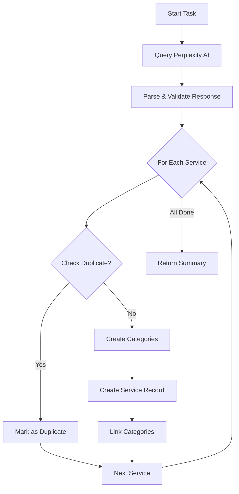

# Fetch Social Services with Trigger.dev

This document explains how to use the Trigger.dev task that automatically researches and adds new privacy-focused social services to the Directus `services` collection using Perplexity AI.

## Overview

The `fetch-social-services` task:
1. Uses Perplexity AI to research emerging privacy-focused social media and messaging services
2. Validates and structures the research data
3. Checks for duplicate services in Directus
4. Creates new service records with status='draft' for manual review
5. Links services to appropriate categories (creating new categories if needed)

## Setup

### Prerequisites

1. **Perplexity API Key**: Already configured in `.env` as `PERPLEXITY_API_KEY`
2. **Directus Access**: Configured via `DIRECTUS_URL` and `DIRECTUS_SERVER_TOKEN` in `.env`
3. **Trigger.dev Account**: Sign up at [trigger.dev](https://trigger.dev) to get your project credentials

### Environment Variables

Your `.env` file should contain:

```env
# Directus Configuration
DIRECTUS_URL="https://directus.thecloud.sucks"
DIRECTUS_SERVER_TOKEN="your_directus_token"

# Perplexity AI Configuration
PERPLEXITY_API_KEY="your_perplexity_api_key"

# Trigger.dev Configuration (get from trigger.dev dashboard)
TRIGGER_SECRET_KEY="your_trigger_secret_key"
```

### Installation

Dependencies are already installed. The following packages were added:
- `@trigger.dev/sdk` - Trigger.dev SDK
- `trigger.dev` - Trigger.dev CLI

## Usage

### Running in Development Mode

To start the Trigger.dev development server:

```bash
pnpm trigger:dev
```

This will:
- Start a local Trigger.dev server
- Watch for changes in your task files
- Allow you to trigger tasks manually from the Trigger.dev dashboard

### Triggering the Task

Once the dev server is running:

1. Go to your Trigger.dev dashboard
2. Find the `fetch-social-services` task
3. Click "Test" or "Run"
4. Optionally provide a payload:
   ```json
   {
     "count": 5
   }
   ```
   - `count`: Number of services to research (default: 5)

### Viewing Results

The task will:
1. Log progress in real-time in the Trigger.dev dashboard
2. Return a summary with:
   - Total services researched
   - Number successfully created
   - Number of duplicates found
   - Number of errors
   - URLs to review each created service in Directus

## Task Flow



## Data Structure

### Perplexity Research Data

The task requests the following fields from Perplexity:

- `name` - Service name (required)
- `short_description` - One sentence description
- `long_description` - Detailed 2-3 paragraph description
- `website_url` - Official website (required)
- `repo_url` - GitHub/GitLab repository URL
- `docs_url` - Documentation URL
- `privacy_policy_url` - Privacy policy URL
- `terms_url` - Terms of service URL
- `self_hostable` - Can users self-host? (boolean)
- `federated` - Supports federation protocols? (boolean)
- `end_to_end_encryption` - E2E encryption status (yes/partial/no/unknown)
- `open_source_clients` - Open source client apps (yes/partial/no/unknown)
- `open_source_server` - Open source server (yes/partial/no/unknown)
- `primary_business_model` - Business model (subscription/donation/ads/mixed/unknown)
- `governance_model` - Governance structure (corporate/foundation/community_project/coop/unknown)
- `categories` - Array of category names (e.g., ["Messaging", "Social Media"])

### Directus Service Record

Services are created in Directus with:

- **Status**: `draft` (requires manual review before publishing)
- **Required Fields**: Populated from Perplexity data
- **Optional Fields**: Set to null if not provided
- **Assessment Fields**: Set to defaults (scores: 0, tier: null)
- **Confidence**: `low` (indicates AI-generated content)
- **Editorial Note**: "Auto-generated from Perplexity AI research. Requires manual review and validation."

## Reviewing Created Services

After the task completes:

1. Check the task output for service URLs
2. Visit each service in Directus: `https://directus.thecloud.sucks/admin/content/services/{id}`
3. Review and validate:
   - Service information accuracy
   - URLs are correct and working
   - Descriptions are appropriate
   - Technical details (encryption, federation, etc.)
   - Assessment scores (update from 0 to appropriate values)
   - Categories are correctly assigned
4. Update the status from `draft` to `published` when ready

## Duplicate Detection

The task checks for duplicates by:
- Service name (exact match)
- Website URL (exact match)

If a duplicate is found, the service is skipped and marked in the results.

## Categories

The task automatically:
- Searches for existing categories by name
- Creates new categories if they don't exist
- Links services to all relevant categories

Categories are created with:
- `name` - From Perplexity data
- `slug` - Auto-generated URL-safe slug
- `status` - Set to `published`

## Error Handling

The task includes:
- Retry logic (3 attempts with exponential backoff)
- JSON parsing with fallback patterns (handles markdown code blocks)
- Validation of required fields
- Per-service error isolation (one failure doesn't stop the entire task)
- Detailed error logging

## Customization

### Changing the Research Prompt

Edit `trigger/lib/perplexity.ts` and modify the `prompt` variable to:
- Target different types of services
- Request additional fields
- Change the focus or criteria

### Adjusting Default Values

Edit `trigger/lib/directus.ts` in the `createService` function to:
- Change default scores
- Modify the editorial note
- Adjust status or confidence levels

### Scheduling

To run the task on a schedule:

1. In `trigger/fetch-social-services.ts`, add a schedule trigger:
   ```typescript
   import { schedules } from "@trigger.dev/sdk/v3";
   
   export const scheduledFetch = schedules.task({
     id: "scheduled-fetch-social-services",
     cron: "0 0 * * 1", // Every Monday at midnight
     run: async (payload) => {
       return await fetchSocialServices.trigger({ count: 5 });
     },
   });
   ```

## Troubleshooting

### Perplexity API Errors

- Verify `PERPLEXITY_API_KEY` is correct in `.env`
- Check API quota/rate limits
- Review Perplexity API status

### Directus Connection Issues

- Verify `DIRECTUS_URL` and `DIRECTUS_SERVER_TOKEN` in `.env`
- Ensure the token has permissions to create services and categories
- Check Directus server is accessible

### JSON Parsing Failures

- Perplexity may return markdown-wrapped JSON
- The task handles this automatically with fallback patterns
- Check logs for the raw response if issues persist

### Duplicate Services

- Review the duplicate detection logic in `trigger/lib/directus.ts`
- Adjust if you need case-insensitive matching or partial URL matches

## Deployment

To deploy the task to Trigger.dev cloud:

```bash
pnpm trigger:deploy
```

This will:
- Build your tasks
- Deploy to Trigger.dev
- Make tasks available for scheduled/webhook triggers

## Files Reference

- `trigger.config.ts` - Trigger.dev project configuration
- `trigger/fetch-social-services.ts` - Main task definition
- `trigger/lib/perplexity.ts` - Perplexity API integration
- `trigger/lib/directus.ts` - Directus database operations
- `.env` - Environment variables and API keys

## Support

For issues or questions:
- Trigger.dev: [docs.trigger.dev](https://docs.trigger.dev)
- Perplexity API: [docs.perplexity.ai](https://docs.perplexity.ai)
- Directus: [docs.directus.io](https://docs.directus.io)
